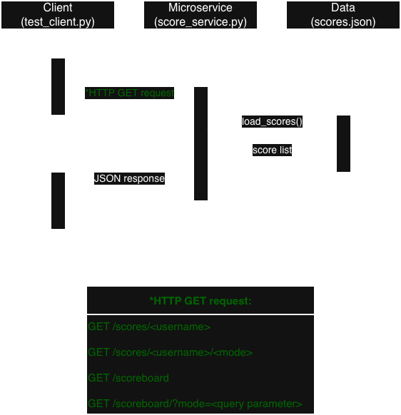

# Scores Microservice

## 1. Overview
The **Scores Microservice** provides read-only access to locally stored score data.\
It uses HTTP `GET` endpoints that enable the client to:
* Retrieve scores for a specified user.
* Retrieve scores for a specified user and mode.
* Retrieve scores from all users (with an optional difficulty filter).


## 2. Repository Contents
The repository contains the following:
* `score_service.py`
    * Microservice with `GET` endpoints to retrieve score data.
* `test_client.py`
    * Python program to demonstrate request data from microservice and display JSON responses.
* `scores.json`
    * Example dataset used by the microservice.
* `requirements.txt`
    * Python dependencies required to run microservice.
* `uml_sequence_diagram.png`
    * UML sequence diagram to illustrate how the client sends the request to the microservice and receives a response.
* `README.md`
    * Documentation for microservice.


## 3. How to Run the Microservice
### 3.1 Installing Dependencies
Run the following while in the project directory containing `requirements.txt`:
```
pip install -r requirements.txt
```

### 3.2 Starting the Microservice
Run the microservice with:
```
python3 score_service.py
```

Expected output:
```
* Serving Flask app 'score_service'
* Debug mode: off
* Running on http://127.0.0.1:5001
```
Note:\
User may receive warning indicating that the running program is a development server.\
This is normal Flask behavior and will not affect the microservice.\
Real production requires Gunicorn or some other equivalence.


## 4. How to Run the Test Client
Ensure `score_service.py` is already running (see [Section 3.1](#31-installing-dependencies)).\
Run the following in a second terminal from the same project directory:
```
python3 test_client.py
```

There are four sections based on each request. For each request, the client sends an HTTP `GET` request,\
prints the HTTP status code, parses the response as JSON, and prints the JSON body.
* `GET /scores/adrian`
* `GET /scores/adrian/Easy`
* `GET /scoreboard`
* `GET /scoreboard?mode=Easy`


## 5. Data Model
The microservice reads score data from the `scores.json` file which is a JSON array.
```
[
  { ... },
  { ... },
  { ... }
]
```

An example is provided below:
```
[
  {
    "username": "adrian",
    "mode": "Easy",
    "level": 1,
    "score": 950000,
    "accuracy": 0.92,
    "max_combo": 120,
    "timestamp": "2025-11-10T10:00:00"
  }
]
```

### Field and Description
|Field|Type|Required|Description|
|---|---|---|---|
|username|string|**Yes**|Name of local user that has obtained score(s).|
|mode|string|**Yes**|Diffculty (normalized to "Easy", "Regular", "Hard").|
|level|integer|Optional|Level played.|
|score|integer|Optional|Score for the round.|
|accuracy|float|Optional|Actual hits over total hits (0 - 1).
|max_combo|integer|Optional|Highest combo achieved during a round.|
|timestamp|string|Optional|Date/time in ISO format.|

### Mode Normalization
Modes are normalized to "Easy", "Regular", or "Hard".\
The microservice normalizes the following valid mode values.\
If the input cannot be normalized, the service returns a 400 error.
|Corresponding Normalized Mode|Valid Mode Values|
|---|---|
|"Easy"|"easy", "slow", "e", "s"|
|"Regular"|"regular", "normal", "medium", "r", "n", "m"|
|"Hard"|"hard", "fast", "h", "f"|


## 6. Communication Contract (API)
The following section describes how a clientt can request data from the microservice and how the data is returned.

### 6.1 Base URL
The microservices runs on the following default URL:
* `http://127.0.0.1:5001`

### 6.2 GET /scores/\<username>
<ins>Description:</ins>

* Returns all scores for a given user across all modes.

<ins>Method:</ins>

* `GET`

<ins>Path Parameter:</ins>

* `<username>` (required)

<details>
<summary> <ins> Example: </ins> </summary>

* Request
    ```
    URL = "http://127.0.0.1:5001"
    resp = requests.get(f"{URL}/scores/adrian")
    data = resp.json()
    ```
* Response\
    Status Code: 200 (ok)
    ```
    {
    "scores": [
        {
        "accuracy": 0.92,
        "level": 1,
        "max_combo": 120,
        "mode": "Easy",
        "score": 950000,
        "timestamp": "2025-11-10T10:00:00",
        "username": "adrian"
        },
        {
        "accuracy": 0.85,
        "level": 3,
        "max_combo": 80,
        "mode": "Hard",
        "score": 700000,
        "timestamp": "2025-11-09T15:00:00",
        "username": "adrian"
        }
    ],
    "status": "ok"
    }
    ```
* Error Response(s)\
    Error Code: 404 (not found)
    ```
    {
    "status": "error",
    "message": "No scores found for user: adrian"
    }
    ```
</details>


### 6.3 GET /scores/\<username>/\<mode>
<ins>Description:</ins>

* Returns all scores for a given user and mode.

<ins>Method:</ins>

* `GET`

<ins>Path Parameter:</ins>

* `<username>` (required)
* `<mode>` (required, see [Mode Normalization](#mode-normalization) for valid values.)

<details>
<summary> <ins> Example: </ins> </summary>

* Request
    ```
    URL = "http://127.0.0.1:5001"
    resp = requests.get(f"{URL}/scores/adrian/Easy")
    data = resp.json()
    ```
* Response\
    Status Code: 200 (ok)
    ```
    {
    "scores": [
        {
        "accuracy": 0.92,
        "level": 1,
        "max_combo": 120,
        "mode": "Easy",
        "score": 950000,
        "timestamp": "2025-11-10T10:00:00",
        "username": "adrian"
        }
    ],
    "status": "ok"
    }
    ```
* Error Response(s)\
    Error Code: 400 (bad request)
    ```
    {
    "status": "error",
    "message": "Invalid mode: supercrazy"
    }
    ```
    Error Code: 404 (not found)
    ```
    {
    "status": "error",
    "message": "No scores found for user 'adrian' in mode 'Easy'"
    }    
    ```
</details>

### 6.4 GET /scoreboard
<ins>Description:</ins>

* Returns all scores across all users. May optionally filter by difficulty using a query parameter.

<ins>Method:</ins>

* `GET`

<ins>Path Parameter:</ins>

* `<username>` (required)
* `<mode>` (optional, see [Mode Normalization](#mode-normalization) for valid values.)

<details>
<summary> <ins> Example 1: </ins> </summary>

* Request
    ```
    URL = "http://127.0.0.1:5001"
    resp = requests.get(f"{URL}/scoreboard")
    data = resp.json()
    ```
* Response\
    Status Code: 200 (ok)
    ```
    {
    "mode": null,
    "scores": [
        {
        "accuracy": 0.92,
        "level": 1,
        "max_combo": 120,
        "mode": "Easy",
        "score": 950000,
        "timestamp": "2025-11-10T10:00:00",
        "username": "adrian"
        },
        {
        "accuracy": 0.85,
        "level": 3,
        "max_combo": 80,
        "mode": "Hard",
        "score": 700000,
        "timestamp": "2025-11-11T15:30:00",
        "username": "david"
        },
        {
        "accuracy": 0.9,
        "level": 2,
        "max_combo": 95,
        "mode": "Regular",
        "score": 880000,
        "timestamp": "2025-11-09T09:15:00",
        "username": "john"
        },
        {
        "accuracy": 0.89,
        "level": 1,
        "max_combo": 110,
        "mode": "Easy",
        "score": 910000,
        "timestamp": "2025-11-08T13:45:00",
        "username": "keiji"
        },
        {
        "accuracy": 0.85,
        "level": 3,
        "max_combo": 80,
        "mode": "Hard",
        "score": 700000,
        "timestamp": "2025-11-09T15:00:00",
        "username": "adrian"
        }
    ],
    "status": "ok"
    }
    ```
* Error Response(s)\
    Error Code: 400 (bad request)
    ```
    {
    "status": "error",
    "message": "Invalid mode: supercrazy"
    }
</details>

<details>
<summary> <ins> Example 2: </ins> </summary>

* Request
    ```
    URL = "http://127.0.0.1:5001"
    resp = requests.get(f"{URL}/scoreboard", params={"mode":"Easy"})
    data = resp.json()
    ```
* Response\
    Status Code: 200 (ok)
    ```
    {
    "mode": "Easy",
    "scores": [
        {
        "accuracy": 0.92,
        "level": 1,
        "max_combo": 120,
        "mode": "Easy",
        "score": 950000,
        "timestamp": "2025-11-10T10:00:00",
        "username": "adrian"
        },
        {
        "accuracy": 0.89,
        "level": 1,
        "max_combo": 110,
        "mode": "Easy",
        "score": 910000,
        "timestamp": "2025-11-08T13:45:00",
        "username": "keiji"
        }
    ],
    "status": "ok"
    }
    ```
* Error Response(s)\
    Error Code: 400 (bad request)
    ```
    {
    "status": "error",
    "message": "Invalid mode: supercrazy"
    }
</details>

## 7. UML Sequence Diagram
The diagram below illustrates the communication flow between client, microservice, and json file.

